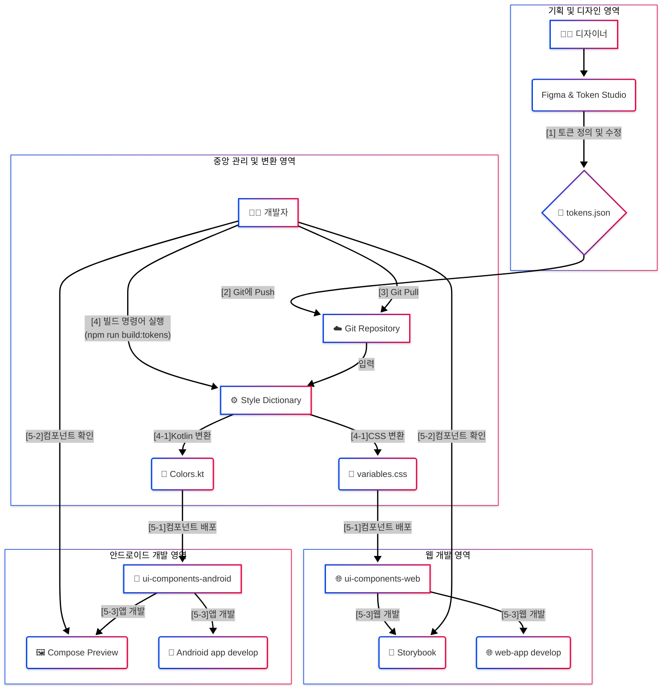

# [NHCX] Figma 기반 DesignOps PoC 구현 가이드 (Web & Android)

이 문서는 Figma와 코드를 연동하여 효율적인 디자인 시스템 및 개발 워크플로우를 검증하는  
DesignOps PoC(Proof of Concept)를 위한 기술 가이드입니다.


이 가이드는 **웹(Vue.js)과 안드로이드(Jetpack Compose)** 두 플랫폼에 대한 PoC 과정을 모두 포함하고 있습니다.  
iOS플랫폼은 PoC 일정 상 제외하였습니다. 각 플랫폼의 개발 경험이 없으셔도 이 문서를 따라오시면 충분히 PoC를 진행하실 수 있습니다.

가이드를 읽기 전 아래 PoC의 목표와 디자인 시스템의 기본 개념을 확인해보세요.
### [DesignOps PoC에 대한 기본 이해](https://storied-cobbler-9d6c2d.netlify.app/)

## NHCX 프로젝트 아키텍처 다이어그램

---

## 1. 프로젝트 목표 (우리가 하려는 것)

> **"디자이너가 Figma에서 정의한 '단일 소스'의 디자인을 여러 플랫폼(Web, Android)의 개발자가 코드로 손쉽게 자동화하고, 그 과정을 효율적으로 만들어 협업 방식을 개선할 수 있는지 검증한다."**

-   **입력**: 디자이너가 **Figma TokenStudio**를 사용해 정의한 디자인 토큰 (색상, 글꼴, 간격 등)이 담긴 `JSON` 파일
-   **과정**: 이 `JSON` 파일을 자동으로 각 플랫폼에 맞는 코드(**CSS** for Web, **Kotlin** for Android)로 변환하고, UI 컴포넌트에 적용합니다.
-   **결과**: 각 플랫폼의 독립된 UI 개발 환경(**Storybook**, **Compose Preview**)에서 디자인 변경사항이 코드에 실시간으로 반영되는 것을 확인합니다.

## 1.1 기술 스택 
-   **UI Components, Page, ProtoType 개발 : Figma, Token Studio** 
-   **UI Component 마이그레이션 : Style Dictionary**
-   **UI 컴포넌트 개발 및 관리 : StoryBook**
-   **웹 개발 : Vite, Vue.js, Pinia, Vue-Router**
-   **앱 개발 : kotlin, JetpackCompose**
-   **IDE** : VSCode, Figma Desktop, Android Studio

---

## 2. 사전 준비: 필요 도구 설치 및 역할

본격적인 설계에 앞서, PoC에 필요한 핵심 도구들의 역할과 설치 명령어를 알아봅니다.

-   **Node.js**: 자바스크립트 실행 환경입니다. `npm`(노드 패키지 매니저)을 포함하고 있어, 다른 모든 도구를 설치하기 위한 기본 전제 조건입니다. [공식 사이트](https://nodejs.org/)에서 LTS 버전을 설치해주세요. node.js를 기 설치한 사람은 아래 커맨드를 이용하여 22.16버전으로 전환하세요
    ```bash
    # 설치 가능한 버전 확인
    nvm list available

    # LTS(22.x) 설치
    nvm install lts     # == nvm install 22.16.0

    # 최신(Current) 설치
    nvm install latest  # == nvm install 24.1.0

    # 원하는 버전 사용
    nvm use 22.16.0     # 또는 nvm use 24

    # 확인
    node -v             # → v22.16.0
    npm -v
    ```


-   **Vite, Vue 3**: Vite는 빠르고 현대적인 웹 개발 빌드 도구이며, Vue는 UI를 만들기 위한 프레임워크입니다. 아래 명령어로 Vue 3 프로젝트를 생성하며 함께 설치됩니다.
    ```bash
    # 프로젝트를 생성하며 Vite와 Vue를 함께 설치
    npm create vite@latest <project-name> -- --template vue
    ```

-   **Vue Router**: Vue.js 공식 라우팅 라이브러리입니다. 웹 앱 내에서 사용자가 여러 페이지를 탐색할 수 있도록 경로를 관리합니다.
    ```bash
    # 웹 프로젝트 폴더 내에서 실행
    npm install vue-router@4
    ```

-   **Storybook**: UI 컴포넌트를 독립된 환경에서 개발하고 문서화하는 도구입니다. 디자이너와 개발자 간의 소통을 원활하게 합니다.
    ```bash
    # 웹 프로젝트 폴더 내에서 실행
    npx storybook@latest init
    ```

-   **Style Dictionary**: 디자인 토큰 '번역기'입니다. 하나의 `JSON` 입력을 받아 여러 플랫폼용 코드(CSS, Kotlin 등)를 동시에 생성하는 핵심 도구입니다.
    ```bash
    # tokens 패키지 폴더 내에서 실행
    npm install style-dictionary
    ```

---

## 3. 프로젝트 구조 설계 (우리가 만들 폴더 구조)

이번 PoC에서는 웹과 안드로이드 프로젝트를 모두 포함하므로, **모든 도구를 하나의 프로젝트(Monorepo)에서 관리**하는 것이 더욱 중요합니다.

### 왜 단일 프로젝트(Monorepo)인가?

-   **✨ 단일 진실 공급원 (Single Source of Truth)**: 모든 디자인의 원천인 `tokens` 패키지를 공유함으로써, 웹과 안드로이드 앱의 디자인 일관성을 완벽하게 유지할 수 있습니다.
-   **🚀 신속한 다중 플랫폼 피드백**: 토큰을 한 번 수정하고 빌드하면, **웹과 안드로이드 양쪽의 코드가 동시에 업데이트**됩니다. 이는 여러 플랫폼에 걸친 DesignOps의 핵심 가치를 증명하는 데 결정적입니다.
-   **🔗 간결한 의존성 관리**: 각 플랫폼 프로젝트가 별도의 배포/설치 과정 없이 로컬 경로를 통해 토큰 결과물을 즉시 가져와 사용할 수 있습니다.

### 확장된 디렉토리 구조

```
nhcx2025/
├── package.json         # 👈 전체 프로젝트 관리 (workspaces 설정)
│
└── packages/
    │
    ├── 🎨 tokens/         # 👈 [공통 역할] 모든 디자인 토큰 관리
    │   ├── input/
    │   │   └── tokens.json
    │   ├── build/
    │   │   ├── css/
    │   │   └── kotlin/
    │   ├── sd.config.cjs
    │   └── package.json
    │
    ├── 📦 ui-components-web/   # 👈 [웹 역할] 컴포넌트 개발 및 데모 앱
    │   ├── .storybook/
    │   │   ├── main.js
    │   │   └── preview.js
    │   ├── src/
    │   │   ├── assets/
    │   │   ├── components/      # 재사용 가능한 순수 UI 컴포넌트 (e.g., 버튼, 인풋)
    │   │   │   └── Button/
    │   │   │       ├── Button.vue
    │   │   │       └── Button.stories.js
    │   │   ├── router/          # 페이지 라우팅(경로) 규칙 정의
    │   │   │   └── index.js
    │   │   ├── styles/          # 전역 스타일 및 토큰 CSS
    │   │   │   └── main.css
    │   │   ├── views/           # 페이지 레벨의 컴포넌트
    │   │   │   ├── HomeView.vue
    │   │   │   └── AboutView.vue
    │   │   ├── App.vue          # 최상위 루트 컴포넌트 (<router-view> 포함)
    │   │   └── main.js          # Vue 앱의 시작점
    │   ├── package.json
    │   └── vite.config.js
    │
    └── 📱 ui-components-android/ # 👈 [안드로이드 역할] 컴포넌트 개발
        ├── build.gradle.kts
        └── src/
            └── main/
                ├── AndroidManifest.xml
                └── java/com/example/my_design_system/
                    ├── components/    # 개별 Composable 컴포넌트
                    │   └── Button.kt
                    └── theme/         # 디자인 시스템 테마 관련 파일
                        ├── Color.kt
                        ├── Theme.kt
                        └── Type.kt
```

### 웹 디렉토리 구조 설명

-   **.storybook**: Storybook의 작동 방식을 정의하는 설정 파일들을 모아두어 프로젝트의 주요 로직과 분리합니다.
-   **src/components**: 버튼, 입력창처럼 작고 재사용 가능한 순수 UI 컴포넌트를 관리합니다. 각 컴포넌트는 Storybook 파일을 함께 두어 독립적으로 개발하고 테스트할 수 있습니다.
-   **src/views**: 여러 `components`를 조합하여 만들어진 페이지 단위의 컴포넌트를 관리합니다. `Home`, `About` 페이지 등이 여기에 해당합니다.
-   **src/router**: 사용자의 URL 경로에 따라 어떤 `view`를 보여줄지 결정하는 라우팅 규칙을 정의합니다.
-   **src/styles**: 전역적으로 사용될 스타일과 Style Dictionary가 생성한 디자인 토큰 CSS를 `@import`하여 관리합니다.

### 안드로이드 디렉토리 구조 설명

-   이 구조는 안드로이드 스튜디오에서 생성하는 표준 라이브러리 모듈 구조를 따릅니다. 이는 안드로이드 개발자에게 가장 익숙한 환경을 제공합니다.
-   **components**: 재사용 가능한 UI 컴포넌트들을 모아 관리하여 모듈화를 강화합니다. 각 컴포넌트 파일 내에 `@Preview` 어노테이션을 사용하여 독립적인 UI 확인 및 개발이 가능합니다.
-   **theme**: 디자인 시스템의 핵심인 색상, 타이포그래피, 테마 설정을 한 곳에서 관리합니다. Style Dictionary가 생성한 `AppColors` 객체를 `Theme.kt`에서 사용하여 디자인 토큰을 실제 앱 테마에 적용합니다.

### 💡 참고: 개발 환경에 대한 안내

"하나의 Git 프로젝트에서 웹과 안드로이드 폴더를 모두 관리하면 안드로이드 스튜디오 사용 시 불편하지 않나요?"

**전혀 불편하지 않으며, 오히려 모노레포의 장점을 극대화하는 방식입니다.**

-   **안드로이드 스튜디오 작동 방식**: 안드로이드 스튜디오에서 프로젝트를 열 때, Git 루트인 `nhcx2025`을 여는 것이 아니라, **안드로이드 프로젝트 폴더인 `packages/ui-components-android`를 직접 선택해서 엽니다.** 스튜디오는 이 폴더를 프로젝트의 루트로 인식하고 Gradle 기반으로 완벽하게 작동합니다.
-   **Git 연동**: 안드로이드 스튜디오의 Git 기능은 현재 열린 폴더(`ui-components-android`)에 `.git`이 없으면, 상위 폴더를 탐색하여 `nhcx2025`에 있는 `.git`을 찾아냅니다. 따라서 스튜디오 내에서 커밋, 푸시, 풀 등 모든 Git 명령은 **전체 저장소를 대상으로 정상적으로 작동**합니다. 개발자는 웹 파트의 변경사항까지 함께 관리할 수 있습니다.

---

## 4. 단계별 구현 가이드

이제 위 구조에 맞춰 프로젝트를 직접 설정해 보겠습니다. 터미널(명령 프롬프트 또는 PowerShell)을 열고 아래 명령어를 순서대로 입력하세요.

### 1단계: 모노레포 기본 구조 만들기

```bash
# 1. 프로젝트 최상위 폴더를 만들고 이동합니다.
mkdir nhcx2025
cd nhcx2025

# 2. npm 프로젝트로 초기화합니다.
npm init -y

# 3. VS Code 등 편집기에서 루트 package.json 파일을 열고,
#    "private": true 와 "workspaces": ["packages/*"] 속성을 추가합니다.
#
#    {
#      "name": "nhcx2025",
#      "private": true,
#      "workspaces": [
#        "packages/*"
#      ],
#      ...
#    }

# 4. 각 패키지 폴더를 생성합니다.
mkdir -p packages/tokens packages/ui-components-web
```

### 2단계: `ui-components-web` (Vue + Storybook) 패키지 설정

```bash
# 1. ui-components-web 폴더로 이동합니다.
cd packages/ui-components-web

# 2. Vite + Vue.js 프로젝트를 생성합니다.
#    (아래 명령어를 실행하고 나오는 질문에 'Vue'와 'JavaScript'를 선택하세요)
npm create vite@latest . -- --template vue

# 3. 필요한 패키지들을 설치합니다.
npm install

# 4. Vue Router를 설치합니다.
npm install vue-router@4

# 5. Storybook을 설치합니다. (시간이 조금 걸릴 수 있습니다)
#    (자동으로 필요한 설정을 진행할지 물으면 'y'를 입력하세요)
npx storybook@latest init
```

### 3단계: `tokens` (Style Dictionary) 패키지 설정 및 플랫폼 추가

```bash
# 1. tokens 폴더로 이동합니다. (cd ../tokens)
cd ../tokens

# 2. npm 프로젝트로 초기화합니다.
npm init -y

# 3. Style Dictionary를 설치합니다.
npm install style-dictionary

# 4. 'input' 폴더를 만들고, Figma에서 받은 tokens.json 파일을 넣어주세요.
mkdir input

# 5. sd.config.cjs 파일을 생성하고 아래 내용을 붙여넣습니다.
touch sd.config.cjs
```

**`sd.config.cjs` 파일 내용:**

```javascript
// packages/tokens/sd.config.cjs
module.exports = {
  source: ['input/tokens.json'],
  platforms: {
    // 1. 웹 플랫폼 설정
    css: {
      transformGroup: 'css',
      buildPath: 'build/css/',
      files: [{
        destination: 'variables.css',
        format: 'css/variables'
      }]
    },
    // 2. 안드로이드 플랫폼 설정 추가
    compose: {
      transformGroup: 'compose',
      buildPath: 'build/kotlin/', // 코틀린 파일이 생성될 경로
      files: [
        {
          destination: 'Colors.kt',
          format: 'compose/object',
          className: 'AppColors', // 생성될 코틀린 객체 이름
          packageName: 'com.example.my_design_system.theme', // 생성될 파일의 패키지 경로
          filter: {
            attributes: {
              category: 'color' // 'color' 카테고리의 토큰만 필터링
            }
          }
        },
      ]
    }
  }
};
```

### 4단계: `ui-components-android` (Jetpack Compose) 패키지 설정

1.  `packages` 폴더 안에 **Android Studio**를 사용하여 `ui-components-android` 라는 이름의 **새로운 안드로이드 라이브러리 모듈**을 생성합니다. (Application 모듈이 아닌 Library 모듈로 생성해야 재사용성이 높아집니다.)
2.  생성된 `ui-components-android` 모듈의 `build.gradle.kts` 파일에 Jetpack Compose 관련 의존성을 추가합니다.
3.  **생성된 토큰 사용하기**: 안드로이드 프로젝트의 테마 파일(e.g., `theme/Theme.kt`)에서 Style Dictionary가 생성한 `Colors.kt` 파일을 `import`하여 사용합니다.

    ```kotlin
    // packages/ui-components-android/src/.../theme/Theme.kt

    import androidx.compose.material3.MaterialTheme
    import androidx.compose.material3.lightColorScheme
    import androidx.compose.runtime.Composable

    // Style Dictionary가 생성한 파일을 import
    import com.example.my_design_system.theme.AppColors

    private val LightColorScheme = lightColorScheme(
        primary = AppColors.colorPrimary, // Figma 토큰 값을 직접 사용
        secondary = AppColors.colorSecondary,
        background = AppColors.colorBackground
        /* ... 다른 색상들 ... */
    )

    @Composable
    fun MyDesignSystemTheme(
        content: @Composable () -> Unit
    ) {
        MaterialTheme(
            colorScheme = LightColorScheme,
            content = content
        )
    }
    ```
4.  **💡 어떻게 `Colors.kt` 파일을 참조하나요?**
    기본적으로 안드로이드 프로젝트는 `src/main/java` 폴더의 코드만 인식합니다. `tokens/build/kotlin`에 생성된 파일을 인식시키려면, **모듈의 `build.gradle.kts` 파일을 수정**해야 합니다.

    `packages/ui-components-android/build.gradle.kts` 파일을 열고 `android` 블록 안에 아래 `sourceSets` 설정을 추가하세요.

    ```kotlin
    // packages/ui-components-android/build.gradle.kts
    android {
        // ... 기존 설정들 ...

        sourceSets {
            getByName("main") {
                java.srcDirs(
                    "src/main/java",
                    // 프로젝트 루트를 기준으로 생성된 토큰 폴더의 경로를 추가
                    "../tokens/build/kotlin"
                )
            }
        }
    }
    ```

    이 설정은 Gradle에게 `../tokens/build/kotlin` 폴더도 소스 코드 폴더로 간주하라고 알려주는 역할을 합니다. 설정을 추가한 후 Android Studio에서 **Gradle Sync**를 실행하면 `import` 구문이 정상적으로 작동합니다.


### 5단계: 전체 시스템 연결 및 스크립트 설정

1.  프로젝트 루트 폴더로 다시 이동합니다. (`cd ../../`)
2.  각 패키지에 `name`을 부여하고 스크립트를 추가합니다.
    -   `packages/tokens/package.json` 에 `"name": "@nhcx2025/tokens"`, `"scripts": { "build": "style-dictionary build" }` 추가
    -   `packages/ui-components-web/package.json` 에 `"name": "@nhcx2025/ui-components-web"` 추가
3.  루트 `package.json` 파일을 열어 전체 프로젝트를 위한 스크립트를 추가합니다.
    ```json
    // /package.json
    {
      "scripts": {
        "build:tokens": "npm -w @nhcx2025/tokens run build",
        "storybook": "npm -w @nhcx2025/ui-components-web run storybook",
        "dev:web": "npm -w @nhcx2025/ui-components-web run dev"
      }
    }
    ```
4.  `ui-components-web`이 `tokens` 패키지를 사용할 수 있도록 의존성을 추가합니다.
    ```bash
    npm install @nhcx2025/tokens -w @nhcx2025/ui-components-web
    ```
5.  `ui-components-web`의 전역 CSS 파일에서 변환된 토큰을 가져오도록 설정합니다.
    -   `packages/ui-components-web/src/styles/main.css` 파일 최상단에 아래 코드를 추가합니다.
        ```css
        @import '@nhcx2025/tokens/build/css/variables.css';
        ```

---

## 5. 핵심 워크플로우 (이렇게 일하게 됩니다!)

1.  **(디자이너)** Figma에서 토큰 수정 → TokenStudio로 `tokens.json` 파일 전달
2.  **(개발자)** Git에서 최신 `tokens.json` 파일을 Pull 받음
3.  **(개발자)** 프로젝트 루트 터미널에서 **단 하나의 명령어** 실행:
    ```bash
    npm run build:tokens
    ```
4.  **(결과)** Style Dictionary가 `build/` 폴더 아래에 **웹용 `css/variables.css`** 와 **안드로이드용 `kotlin/Colors.kt`** 파일을 **동시에** 업데이트함
5.  **(각 플랫폼 개발자)**
    -   **웹 개발자**: `npm run storybook`을 실행하여 웹 브라우저에서 변경된 컴포넌트 확인
    -   **안드로이드 개발자**: Android Studio에서 프로젝트를 **Gradle Sync** 하고, `@Preview`를 통해 변경된 컴포넌트 확인

---

## 6. 맺음말

이처럼 Style Dictionary와 Monorepo 구조를 활용하면, **디자인 변경이 발생했을 때 단 한 번의 빌드로 모든 플랫폼에 일관된 디자인을 신속하게 적용**할 수 있습니다. 이것이 바로 우리가 이 PoC를 통해 검증하고자 하는 강력한 DesignOps 워크플로우입니다.

PoC를 진행하면서 궁금한 점이나 막히는 부분이 있다면 언제든지 편하게 질문해주세요. 함께 문제를 해결하며 성공적인 PoC를 만들어 갑시다!
